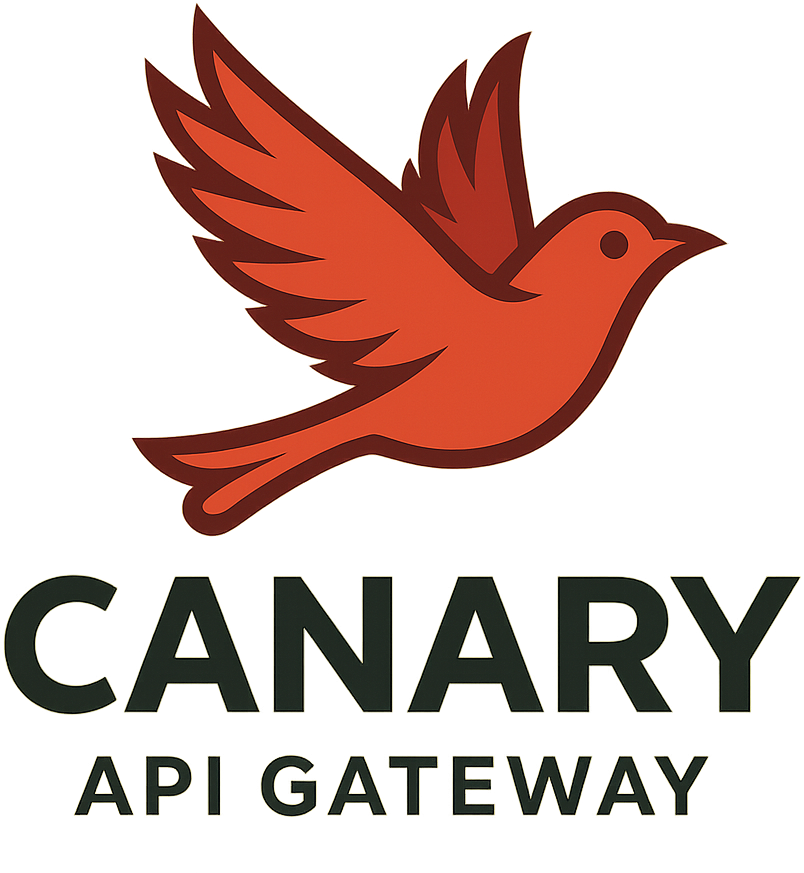

<p align="center">
  
</p>

# Canary

A modular Go-based API gateway that proxies requests to upstream services. Canary comes packaged with built-in throttling, rate-limiting, retries, auth, gzip compression, and comprehensive request handling out-of-the-box.

## Features

- **Automatic Gzip Compression**: Reduces bandwidth by 60-80% for JSON/text responses
- **Rate Limiting**: Global and per-IP token bucket rate limiting
- **Request Throttling**: Maximum concurrent request limits
- **Automatic Retries**: Exponential backoff for failed upstream requests
- **Health Checks**: Simple endpoint for load balancer probes
- **Authentication**: Secure endpoints by validating user credentials/JWT tokens before proxying
- **Modular Architecture**: Clean separation of concerns for easy maintenance

## Project Structure

```
API_Gateway_ACA/
├── apig.go                          # Main application entry point
├── internal/
│   ├── config/
│   │   └── config.go               # Configuration management
│   ├── middleware/
│   │   └── middleware.go           # All middleware (gzip, logging, rate limiting, etc.)
│   ├── proxy/
│   │   └── proxy.go                # Reverse proxy with retry logic
│   └── router/
│       └── router.go               # Route registration and management
```

## Routing

- **`/`**: Returns `200 OK` with `"ok"` response (health check endpoint)
- **`/api/auth/*`**: Routes to IAM service (e.g., `/api/auth/login` → IAM service `/api/auth/login`)
- **`/api/onboarding/*`**: Routes to onboarding service

## Configuration

All configuration is managed through environment variables with sensible defaults:

### Server Configuration
- **`PORT`**: Server listening port (default: `80`)

### Throttling
- **`MAX_IN_FLIGHT`**: Maximum concurrent requests (default: `256`)

### Rate Limiting
- **`PER_IP_RPS`**: Requests per second per IP (default: `10`)
- **`PER_IP_BURST`**: Burst capacity per IP (default: `20`)
- **`GLOBAL_RPS`**: Global requests per second (default: `200`)
- **`GLOBAL_BURST`**: Global burst capacity (default: `400`)
- **`LIMITER_TTL`**: Cleanup interval for idle IP limiters (default: `10m`)

### Retry Behavior
- **`RETRY_ATTEMPTS`**: Number of retry attempts for idempotent requests (default: `3`)
- **`RETRY_BACKOFF`**: Initial backoff delay (default: `150ms`)
- **`RETRY_MAX_BACKOFF`**: Maximum backoff delay (default: `1500ms`)

## Adding New Endpoints

To add a new upstream service:

### 1. Add Configuration
Edit `internal/config/config.go` and add to `UpstreamConfig`:

```go
type UpstreamConfig struct {
    AuthURL       string
    OnboardingURL string
    NewServiceURL string  // Add this
}
```

Then update the `Load()` function:

```go
Upstream: UpstreamConfig{
    // ... existing config ...
    NewServiceURL: env("NEW_SERVICE_URL", "https://new-service.example.com"),
}
```

### 2. Create Proxy
Edit `apig.go` and add proxy creation:

```go
newServiceURL, err := url.Parse(cfg.Upstream.NewServiceURL)
if err != nil {
    log.Fatalf("invalid NEW_SERVICE_URL: %v", err)
}

newServiceProxy := proxy.NewReverseProxy(newServiceURL, proxy.Config{
    Attempts:     cfg.Retry.Attempts,
    BaseBackoff:  cfg.Retry.BaseBackoff,
    MaxBackoff:   cfg.Retry.MaxBackoff,
    TargetServer: newServiceURL.Hostname(),
})
```

### 3. Register Routes
Edit `internal/router/router.go`:

- Update the `Router` struct to include the new proxy:

```go
type Router struct {
    mux             *http.ServeMux
    authProxy       *httputil.ReverseProxy
    onboardingProxy *httputil.ReverseProxy
    newServiceProxy *httputil.ReverseProxy  // Add this
}
```

- Update `New()` function to accept the new proxy parameter

```go
// New creates a new router with the given proxies
func New(authProxy, onboardingProxy *httputil.ReverseProxy) *Router {
	return &Router{
		mux:             http.NewServeMux(),
		authProxy:       authProxy,
		onboardingProxy: onboardingProxy,
    newServiceProxy: newServiceProxy //Add this
	}
}
```

- Add routing logic in `handleAPI()`:

```go
// Route /api/newservice/* to new service
if strings.HasPrefix(r.URL.Path, "/api/newservice") {
    rt.newServiceProxy.ServeHTTP(w, r)
    return
}
```

## Enabling Authentication

Canary includes a commented-out authentication function that can validate user tokens before proxying requests to upstream services.

### To Enable Authentication:

1. Edit `internal/router/router.go`
2. Uncomment the `authenticateRequest` function at the bottom of the file
3. Uncomment the authentication check in the `handleAPI` function:

```go
func (rt *Router) handleAPI(w http.ResponseWriter, r *http.Request) {
    // Uncomment these lines:
    if !rt.authenticateRequest(r) {
        http.Error(w, "Unauthorized", http.StatusUnauthorized)
        return
    }
    // ... rest of routing logic
}
```

4. Update the validation URL in `authenticateRequest` to point to your IAM service's token validation endpoint

The included example validates tokens by:
- Extracting the `Authorization: Bearer <token>` header
- Making an HTTP request to your IAM service's validation endpoint
- Forwarding the token and checking for a `200 OK` response

You can customize this to use JWT validation, Redis caching, or any other authentication method.

## Customizing Behavior

### Adjust Rate Limits
Edit `internal/config/config.go` and modify the default values in the `Load()` function, or set environment variables.

### Modify Retry Logic
Edit `internal/proxy/proxy.go` to customize retry behavior, backoff strategies, or which HTTP methods are retryable.

### Add/Remove Middleware
Edit `apig.go` and modify the middleware chain:

```go
handler := middleware.WithRecover(
    middleware.WithLogging(
        middleware.WithGzip(
            // Add custom middleware here
            middleware.WithThrottle(throttle,
                middleware.WithRateLimit(globalLimiter, perIPLimiter,
                    rt.Handler(),
                ),
            ),
        ),
    ),
)
```

### Customize Middleware
Edit `internal/middleware/middleware.go` to modify existing middleware behavior (logging format, gzip settings, etc.).

## Request Flow

1. **Recovery**: Catches panics and prevents server crashes
2. **Logging**: Logs request method, path, status code, and duration
3. **Gzip**: Compresses responses if client supports it
4. **Throttling**: Limits concurrent requests
5. **Rate Limiting**: Enforces global and per-IP rate limits
6. **Routing**: Determines which upstream service to proxy to
7. **Proxy**: Forwards request with proper headers and retry logic

## Development

### Running Locally
```bash
go run apig.go
```

### Building
```bash
go build -o gateway apig.go
```

### Docker
```bash
docker build -t api-gateway .
docker run -p 80:80 api-gateway
```

## Features in Detail

### Gzip Compression
- Automatically compresses responses when client sends `Accept-Encoding: gzip`
- Typical compression: 60-80% size reduction for JSON/text
- Transparent to clients

### Retry Logic
- Only retries idempotent methods (GET, HEAD, OPTIONS, PUT, DELETE)
- Exponential backoff with jitter
- Retries on network errors and 5xx responses
- Configurable attempts and backoff delays

### Header Management
- Strips `/api` prefix from paths
- Sets `X-Real-IP`, `X-Forwarded-For`, `X-Forwarded-Proto`
- Removes hop-by-hop headers
- Preserves upstream host for SNI

### Rate Limiting
- Token bucket algorithm
- Separate limits for global and per-IP
- Automatic cleanup of idle IP buckets
- Returns `429 Too Many Requests` with `Retry-After` header


